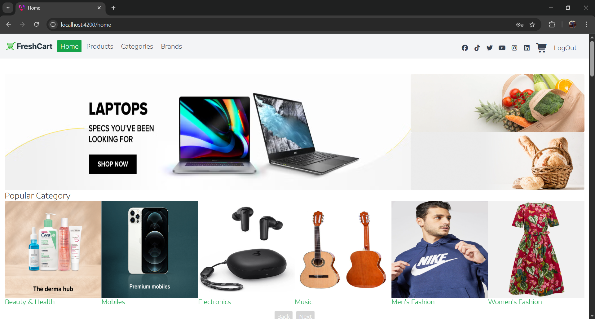
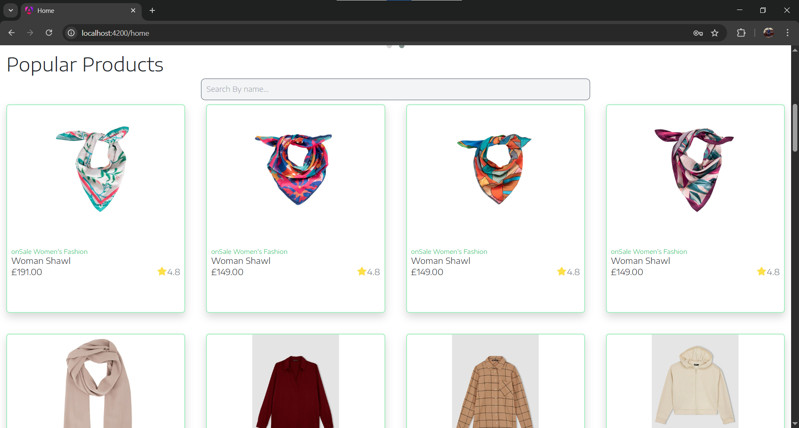
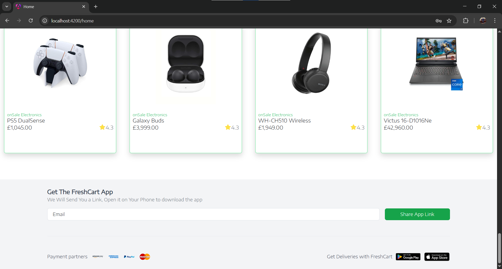
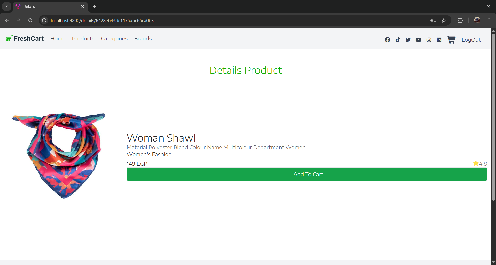
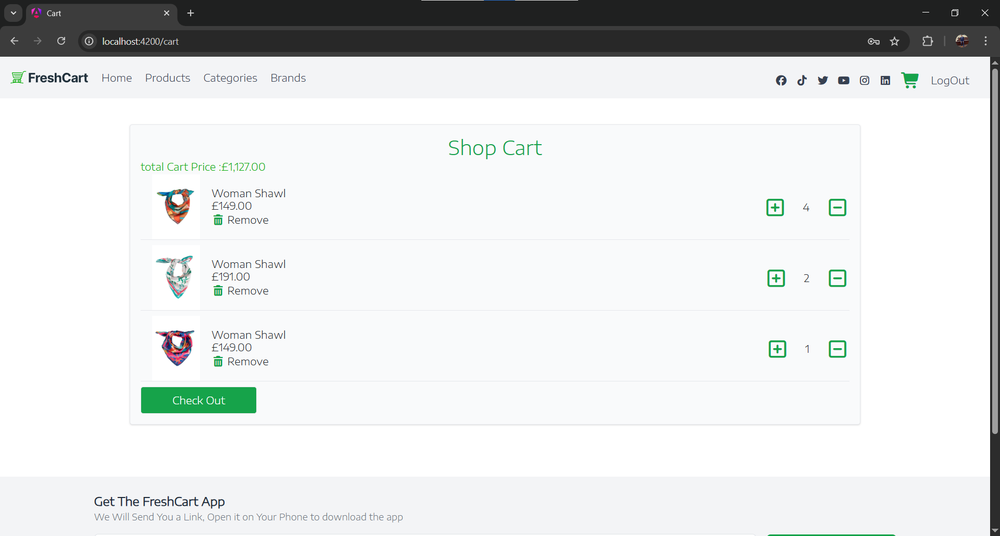
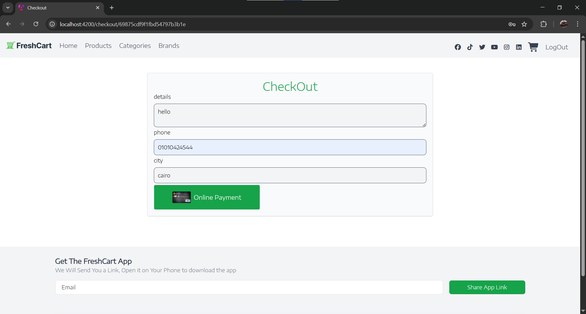
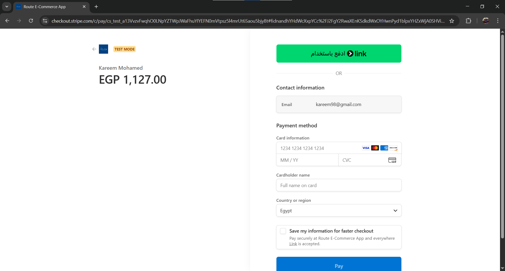
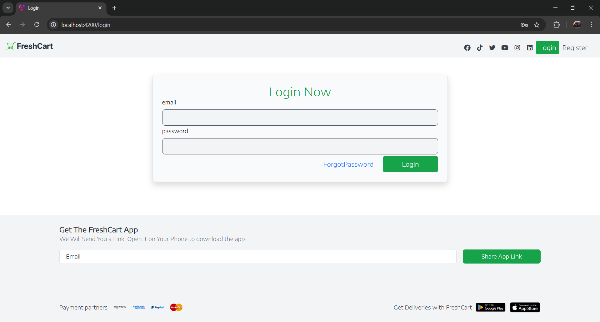
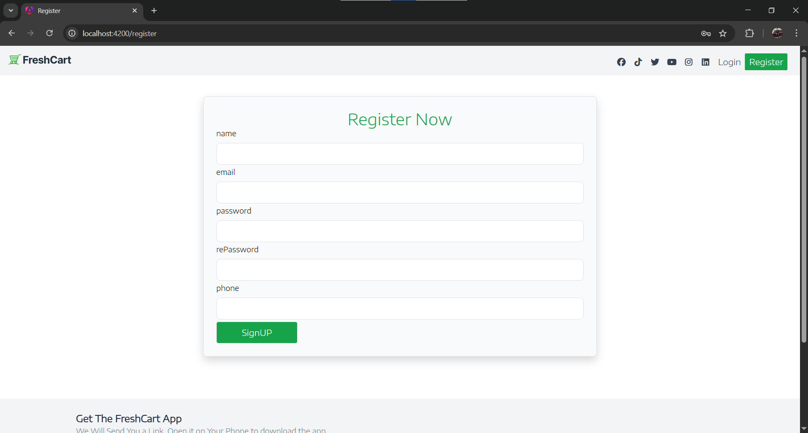

# Fresh Cart E-Commerce

## 🌟 Overview
Fresh Cart is a responsive e-commerce web application built with **Angular**.  
It allows users to browse products, manage a shopping cart, and complete purchases with **Stripe Payment Gateway**.  
The application supports bilingual functionality (English & Arabic) and Dark/Light mode.

---

## 🚀 Features
- Product listing with categories and detailed pages  
- Shopping cart with quantity updates and item removal  
- Checkout flow with **Stripe integration** for secure payments  
- RESTful API integration for products, orders, and user management  
- Responsive design for desktop and mobile devices  
- Bilingual support: English & Arabic  
- Dark & Light mode toggle  

---

## Technologies Used
- **Front-End:** Angular, TypeScript, HTML5, CSS3, TailwindCSS  
- **State Management:** RxJS  
- **Payment Integration:** Stripe API  
- **API:** RESTful API (Backend not included in this repo)  

---

## 📸 Screenshots

### Homepage




### details 


### cart Details


### checkout Page


### payment


### Auth




---

## Installation
1. Clone the repository:
```bash
git clone https://github.com/kareemhosssm/fresh-cart-angular.git
 cd ak-grand-hotel
2. **Frontend Setup (Angular):**
  ```bash
   cd frontend
   npm install
   ng serve
  
## 👥 Project Contributors

Kareem Mohamed - Frontend Architect


